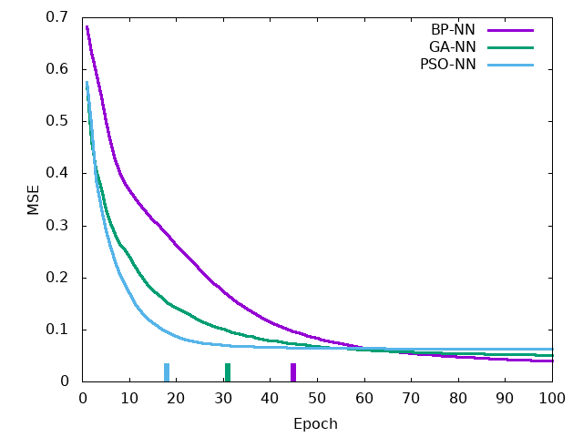
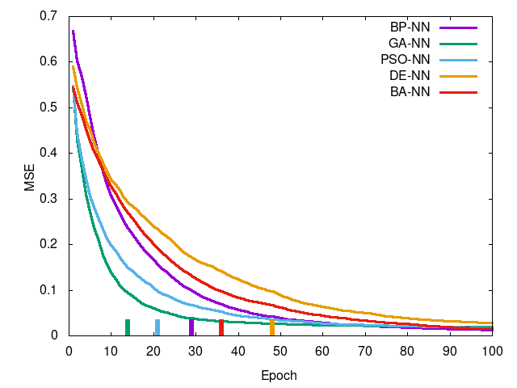
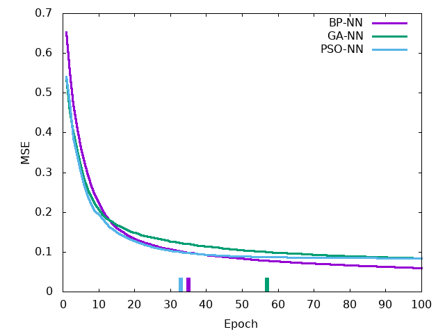
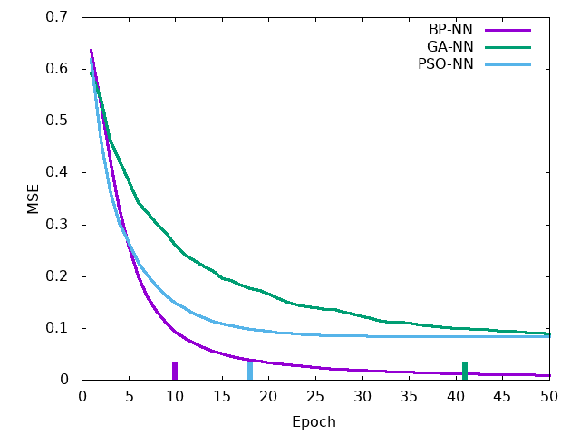
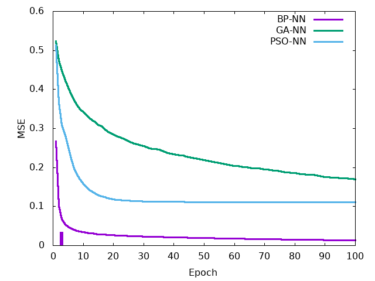
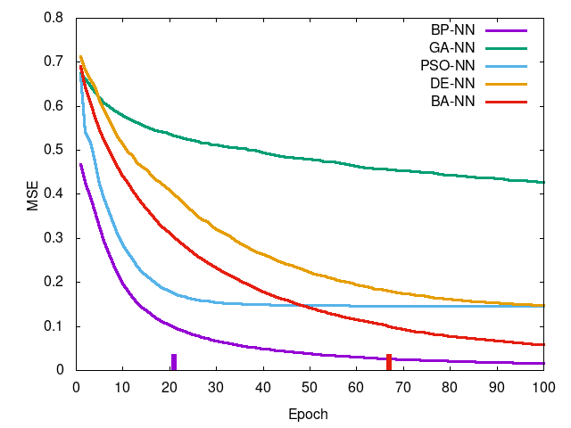

# Metaheuristic Training Networks

This repository was used for a comparative study between backpropagation trained feed forward networks and the same using various metaheuristics in place of backpropagation. I was interested in using PSO to train a neural network and decided to compare it to BP, and it lead to implementing more metaheuristics.

I wrote a <a href="./report/report.pdf">paper</a> describing my experimental methodology and results in more detail. I also wrote <a href="https://github.com/stratzilla/AI-ML-tutorials">tutorials</a> for implementing each metaheuristic, alone and when used in conjunction with a neural network. The code found in this repository is more or less taken straight from these tutorials as I made the tutorials to prepare for my experimentation.

The code herein includes an implementation of a feedforward neural network trained using backpropagation, genetic algorithm, particle swarm optimization, differential evolution, and bat algorithm. There is also a testing suite to train multiple networks concurrently to generate plots to compare between them.

# Dependencies

- GNU/Linux
- Python 3.6
- `pandas`
- `matplotlib`

`pandas` is used to load and normalize input data and is necessary to reproduce the results found here. `matplotlib` is used to plot error over time curves on single execution (not necessary for automation script).

## Optional Dependencies

- `gnuplot`
- R
- `purrr` library for R

The automation script `results_collection.sh` requires the above dependencies, although they are not necessary for standard single execution. `gnuplot` is used to concatenate error over time curves from each metaheuristic into one figure, and R is used to perform statistical tests comparing each metaheuristic.

# Execution

You can clone this repository to your computer like so:

```bash
 $ git clone https://www.github.com/stratzilla/metaheuristic-training-networks
```

You can run any of the training scripts in `/code` like so:

```bash
 $ ./backprop_network.py <arg>     # BP-NN
 $ ./genetic_network.py <arg>      # GA-NN
 $ ./particle_network.py <arg>     # PSO-NN
 $ ./evolve_network.py <arg>       # DE-NN
 $ ./bat_network.py <arg>          # BA-NN
```

This will train a single network and output a `matplot` plot showing the mean squared error over epochs as well as training and testing accuracy per epoch.

If you want to automate training multiple networks to find the mean between training runs, you can instead execute the below from `/helpers`:

```bash
 $ ./results_collection.sh <arg>
```

This will train a hundred networks of each type, concatenate the results into a master CSV file, use R perform various statistical tests, then use `gnuplot` to make a master plot comparing each training technique. All results are found in `\results`. You can edit this file manually to change how many runs per network and how many concurrent runs (default is `100` and `10` respectively, chosen for my system configuration, yours may differ).

Both single execution and automation scripts use these for `<arg>`:

- `iris` for Iris data set
- `penguins` for Penguins data set
- `wheat` for Wheat Seeds data set
- `wine` for Wine data set
- `breast` for Breast Cancer data set
- `ionosphere` for Ionosphere Radar data set

While the automation script has an additional argument for `<arg>`:

- `all` as argument for `results_collection.sh` will train using all data sets

The algorithms are data agnostic and will take any data, you just need to preprocess data to be accepted: final columnar value for data is the classification while the others are attributes. Classes must be enumerated starting at `0`, and attributes should be numerical (continuous or integer).

Network and metaheuristic parameters can be found in `/code/network_params.py`: it's separated so you can edit and test parameters without editing each network's code. The parameters as seen there work generally well but of course you can probably find better parameters through experimentation.

# Data

I tested six data sets as found in `/data`: Iris, Penguins, Wheat Seeds, Wine, Breast Cancer, and Ionosphere Radar. Here is some information about each data set:

| Data Set         | Instances | Attributes | Classes |
| ---------------- | --------- | ---------- | ------- |
| Iris             | 151       | 4          | 3       |
| Penguins         | 333       | 6          | 3       |
| Wheat Seeds      | 211       | 7          | 3       |
| Wine             | 178       | 13         | 3       |
| Breast Cancer    | 570       | 31         | 2       |
| Ionosphere Radar | 352       | 34         | 2       |

Each network structure was different for each data set. Since dimensionality of the problem is based on the network topology, it was also found (NB: HL and OL have one bias neuron):

| Data Set         | IL Size | HL Size | OL Size | Dimensionality |
| ---------------- | ------- | ------- | ------- | -------------- |
| Iris             | 4       | 3       | 3       | 27             |
| Penguins         | 6       | 4       | 3       | 43             |
| Wheat Seeds      | 7       | 5       | 3       | 58             |
| Wine             | 13      | 6       | 3       | 105            |
| Breast Cancer    | 31      | 8       | 2       | 274            |
| Ionosphere Radar | 34      | 10      | 2       | 372            |

Dimensionality is simply `(HL * (IL + 1)) + (OL * (HL + 1))`. These data sets were chosen to visualize results on iteratively increasing dimensionality and to see if one network training method was better for a specific problem size.

# Results

You can see CSV results in `/results/csv` or for a visualization of mean squared error over epochs for each network, you can see these in `/results/plots`. Statistical test results are found in `/results/statistics`. Below is a summary of results:

 

 

 

Left-to-right, top-to-bottom: Iris data set, Penguins data set, Wheat Seeds data set, Wine data set, Breast Cancer data set, Ionosphere Radar data set. Curve is mean squared error per epoch and the tick at the bottom is the epoch in which training reached a termination condition (MSE <= 0.1).
